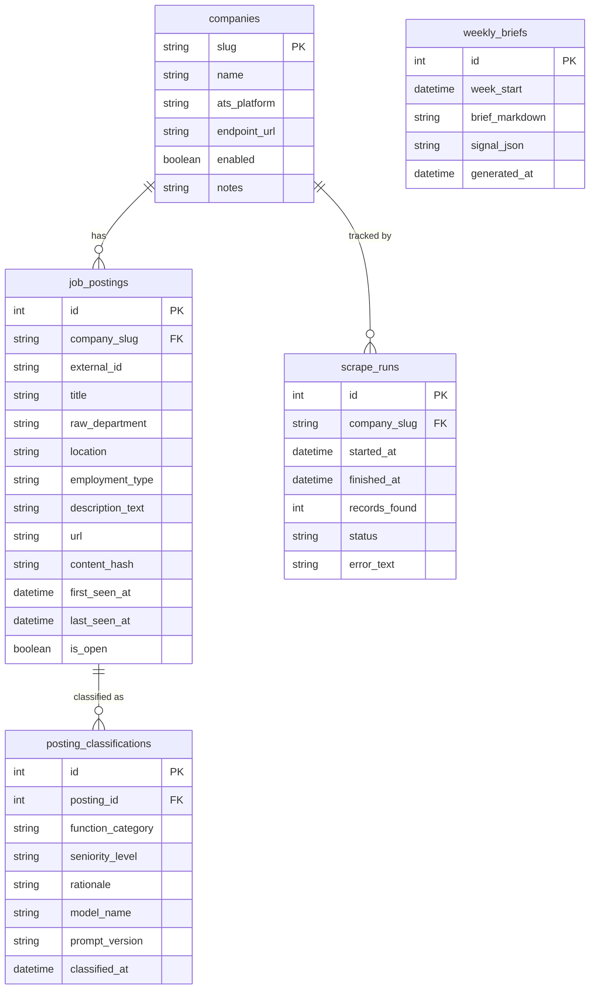

# Database Schema

## Design Principles

**History-preserving**: `job_postings` accumulates history and never deletes rows. When a posting reappears, only `last_seen_at` is bumped. When it disappears from a *successful* scrape run, `is_open` is set to `False`. A failed scrape never marks postings as closed — otherwise a network error would look like every role vanishing overnight.

**Classification versioning**: `posting_classifications` stores one row per posting per `prompt_version`. When the taxonomy or prompt changes, a new version string is used. Old classifications remain for comparison. `get_unclassified(prompt_version)` returns postings that lack a classification at that version, so re-running classification after a prompt change only processes what's needed.

**Content-change detection**: `content_hash` is SHA-256 of `title + description_text`. When a company edits a posting (changed title or description), the hash changes on the next upsert. The LLM layer can skip postings whose hash hasn't changed since the last classification.

## Tables

### companies

Primary reference table for tracked companies, synced from `companies.yaml`.

| Column | Type | Notes |
|---|---|---|
| slug | VARCHAR(64) | **PK** |
| name | VARCHAR(128) | Display name |
| ats_platform | VARCHAR(32) | greenhouse, lever, darwinbox, keka, custom, unknown |
| endpoint_url | TEXT | API or scrape URL (nullable) |
| enabled | BOOLEAN | Whether the company is included in scrape runs |
| notes | TEXT | Free-form notes (nullable) |

### job_postings

Append-only history of every job posting ever seen.

| Column | Type | Notes |
|---|---|---|
| id | INTEGER | **PK**, auto-increment |
| company_slug | VARCHAR(64) | **FK → companies.slug**, indexed |
| external_id | VARCHAR(256) | ATS-assigned job ID |
| title | VARCHAR(512) | |
| raw_department | VARCHAR(256) | As reported by the source (nullable) |
| location | VARCHAR(256) | (nullable) |
| employment_type | VARCHAR(64) | full-time, contract, intern, etc. (nullable) |
| description_text | TEXT | Plain-text job description (nullable) |
| url | TEXT | Direct link to posting (nullable) |
| content_hash | VARCHAR(64) | SHA-256 of title + description_text |
| first_seen_at | DATETIME | Set on insert, never updated |
| last_seen_at | DATETIME | Bumped on every successful sighting |
| is_open | BOOLEAN | False when posting disappears from a successful run |

**Constraints**: UNIQUE(company_slug, external_id). Index on (company_slug, is_open).

### posting_classifications

LLM-generated classification of a posting's function and seniority level. Versioned by prompt so taxonomy changes are non-destructive.

| Column | Type | Notes |
|---|---|---|
| id | INTEGER | **PK**, auto-increment |
| posting_id | INTEGER | **FK → job_postings.id**, indexed |
| function_category | VARCHAR(128) | e.g. "engineering", "product", "sales" |
| seniority_level | VARCHAR(64) | e.g. "junior", "mid", "senior", "lead", "director" |
| rationale | TEXT | LLM's reasoning (nullable) |
| model_name | VARCHAR(64) | e.g. "gemini-2.0-flash" |
| prompt_version | VARCHAR(32) | e.g. "v1", "v2" |
| classified_at | DATETIME | When classification was performed |

### scrape_runs

Audit log of every scrape attempt per company.

| Column | Type | Notes |
|---|---|---|
| id | INTEGER | **PK**, auto-increment |
| company_slug | VARCHAR(64) | **FK → companies.slug**, indexed |
| started_at | DATETIME | |
| finished_at | DATETIME | (nullable for in-progress runs) |
| records_found | INTEGER | (nullable) |
| status | VARCHAR(32) | "success", "error", "partial" |
| error_text | TEXT | (nullable) |

### weekly_briefs

Generated intelligence briefs stored for historical reference.

| Column | Type | Notes |
|---|---|---|
| id | INTEGER | **PK**, auto-increment |
| week_start | DATETIME | Monday of the reporting week |
| brief_markdown | TEXT | The rendered brief |
| signal_json | TEXT | Structured signals as JSON (nullable) |
| generated_at | DATETIME | |

## ER Diagram

